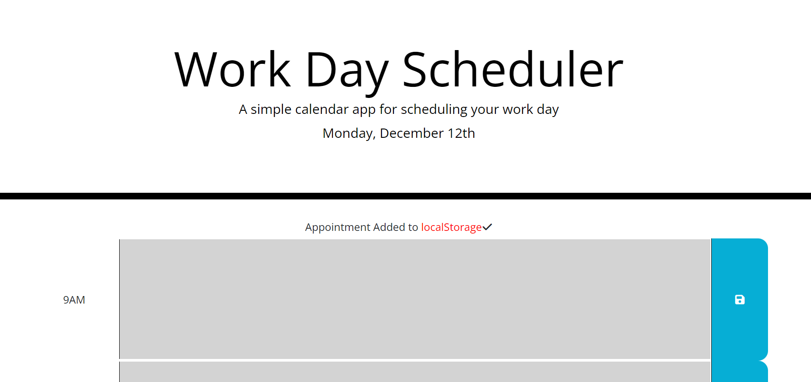

# work-day-scheduler

> A work day scheduler that displays the current date. Allows the user to add text to each hour and will persist on page reload. Colour changes for each hour that represent past, present, future hours.

## Table of contents

- [General info](#general-info)
- [Screenshots](#screenshots)
- [Technologies](#technologies)
- [Setup](#setup)
- [Live Application](#live-application)
- [Features](#features)
- [Status](#status)
- [Contact](#contact)

## General info

Made with MomentJS to fetch current time and to practise jQuery plus setting and retreiving items from local storage.

## Screenshots

## Technologies

- HTML
- CSS
- JavaScript
- jQuery
- MomentJS

## Setup

- Open the index.html in any modern browser
- Type into the text box
- Click save icon to save data to local storage
- Popup message that confirms a task has been saved to local storage.

## Live Application

https://sbillsborough.github.io/work-day-scheduler/

## Features

- Displays current date on page load
- Stores text to local storage
- Time block colours that represent past, present and future hours

## Status

Project is: _in progress_

## Contact

Created by [billsboroughscott@gmail.com] - feel free to contact me!
